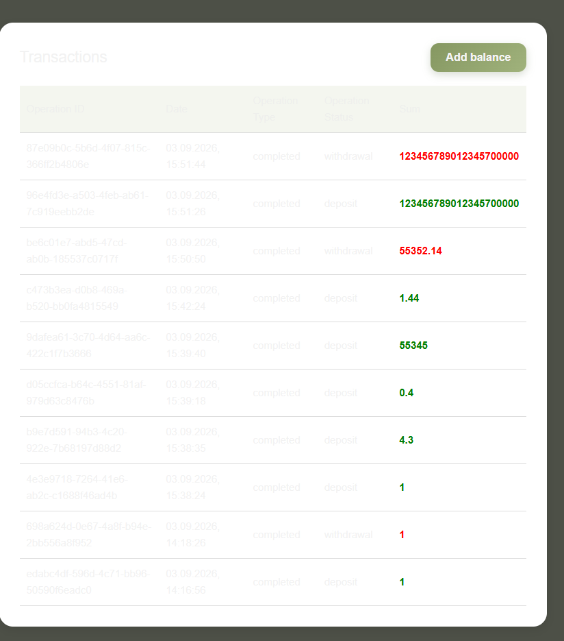
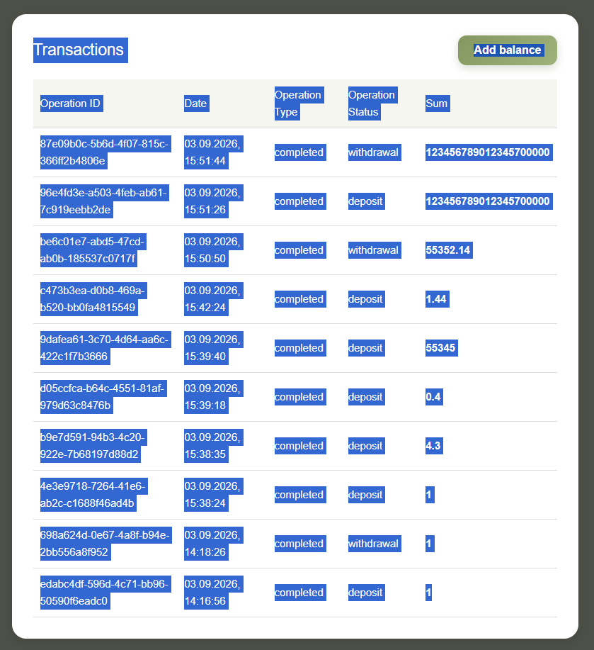

1. Главная страница (/)
1.1. Зависание при вводе длинного текста в поле "Payment purpose"
Приоритет: Критический

Описание: При вводе очень длинной строки (1000+ символов) страница зависает, после "отвисания" поле становится недоступным.

Шаги: Перейти на главную, вставить 1000+ символов в Payment purpose.

Ожидаемый результат: Ограничение длины.

Фактический результат: Страница зависает, поле недоступно.

Статус автоматизации: Автоматизирован (BUG: Page freezes with long payment purpose в bugs.spec.ts). Тест помечен test.fail().

1.2. Некорректная валидация номера телефона
Приоритет: Критический

Описание: Поле "Phone number" принимает буквы и любые символы; перевод совершается на номер с буквой или эмодзи (например, +7(928) 153-03-5f).

Шаги: Ввести номер с буквой, заполнить остальные поля, отправить.

Ожидаемый результат: Ошибка валидации, перевод не выполняется.

Фактический результат: Перевод выполняется.

Статус автоматизации: Автоматизирован (BUG: Transfer with invalid phone (letters) succeeds в bugs.spec.ts). Тест помечен test.fail().

.3. Поле "Amount": буква 'e', стрелки уводят в отрицательное значение
Приоритет: Средний

Описание: В поле Amount можно ввести букву 'e', но отправка блокируется; отрицательные и 0 не отправляются, но стрелки позволяют увидеть отрицательное значение.

Шаги: Ввести -5 или 0, попытаться отправить; нажать стрелку вниз.

Ожидаемый результат: Отрицательные и 0 не допускаются, поле не должно позволять некорректный ввод.

Фактический результат: Отправка блокируется, но визуально можно увидеть отрицательное значение.

Статус автоматизации: Частично автоматизирован (should not allow transfer with invalid amount в validation.spec.ts). Проверяются 0 и -5

1.4. Валидация длины номера телефона работает корректно
Приоритет: Низкий (положительный момент)

Описание: Сообщение "Phone must contain 10–15 digits" появляется при несоответствии длины.

Статус автоматизации:  Не автоматизирован

1.5. Непоследовательная очередность и типы алертов при пустой форме перевода
Приоритет: низкий

Описание: При пустой форме сначала появляются ошибки для Amount и Payment purpose (одного типа), после их заполнения — для Phone (другого типа).

Шаги: Оставить все поля пустыми → отправить; заполнить Amount и Purpose → отправить.

Ожидаемый результат: Ошибки появляются одновременно или последовательно и в едином стиле.

Фактический результат: Сначала ошибки для Amount и Purpose, потом для Phone, стили разные.

Статус автоматизации: Автоматизирован (should show proper validation sequence for empty transfer form в validation.spec.ts). Тест помечен test.fail()

1.6. Обязательность поля "Payment purpose"
Приоритет: Низкий

Описание: Поле обязательное. Вопрос: нужно ли это?

Статус автоматизации:  Не автоматизирован не баг. Требование продукта?

2. Страница профиля (/profile)

2.1. Отображение данных пользователя

Описание: Name, Surname, Email отображаются корректно.

3. Страница транзакций (/transactions)

3.1. Нет алертов при попытке некорректного пополнения баланса
Приоритет: Высокий

Описание: При нажатии "Add" с пустым или некорректным полем Amount не появляется сообщение об ошибке.

Шаги: Перейти на /transactions, ввести отрицательное значение или оставить пустым, нажать Add.

Ожидаемый результат: Появление сообщения об ошибке.

Фактический результат: Ничего не происходит.

Статус автоматизации: Автоматизирован (BUG: No alerts when topping up with invalid amount в bugs.spec.ts). Тест помечен test.fail().

3.2. Некорректный ввод очень больших чисел
Приоритет: Средний

Описание: При вводе более 16 цифр поле ломается, на 22-м символе отображается экспоненциальная запись.

Ожидаемый результат: ограничение на кол-во символов

Фактический результат: Ничего не происходит ломается ввод и далее отображается экспоненциальная запись

Статус автоматизации: Не автоматизирован 

3.3. Плохая читаемость текста 
Приоритет: Низкий (визуальный деффект)

Описание: светлый текст на белом фоне

3.4. Дата отстаёт на 3 часа
Приоритет: Средний

Статус автоматизации:  Не автоматизирован.

3.5. Перепутаны местами Operation Type и Operation Status
Приоритет: Высокий

Описание: В Operation Type показывается статус (complete), а в Operation Status — тип операции (deposit).

Статус автоматизации: Автоматизирован (should add balance and show correct transaction type/status в transactions.spec.ts). Тест помечен test.fail().

4. Страница входа (/login)

4.1. Ошибка "Failed to load balance" при клике на логотип
Приоритет: Средний

Статус автоматизации: Автоматизирован (should show alert when clicking logo while unauthenticated в validation.spec.ts).

5. Страница регистрации (/register)

5.1. Ошибка "Failed to load balance" при клике на логотип
Приоритет: Средний

Статус автоматизации: Не автоматизирован ( дублирует 4.1 ).

5.2. Поля Name и Surname принимают любые символы
Приоритет: Средний

Статус автоматизации:  Не автоматизирован.

5.3. Email валидируется, но пропускает сомнительные адреса
Приоритет: Низкий

Описание: можно зарегистрировать пользователя с почтой 1@1.1

Статус автоматизации:  Не автоматизирован.

5.4. Поле Password принимает любые символы и длину
Приоритет: Средний

Описание: отсутствует валидация

Статус автоматизации: Не автоматизирован.

5.5. Нет кнопки перехода на /login
Приоритет: Низкий

5.7. Ошибка 500 при регистрации с длинными значениями полей
Приоритет: Критический

Статус автоматизации: Не автоматизирован.

6. Общие проблемы

6.1. Проблемы с сессией и балансом при нескольких вкладках
Приоритет: Высокий

Описание: При использовании двух вкладок баланс может отображаться нулевым до обновления.

Шаги: быть авторизованным на 2 вкладках => разлогинится на 1 => перейти на 2 вкладку => авторизоватся.
 
Статус автоматизации: Не автоматизирован.